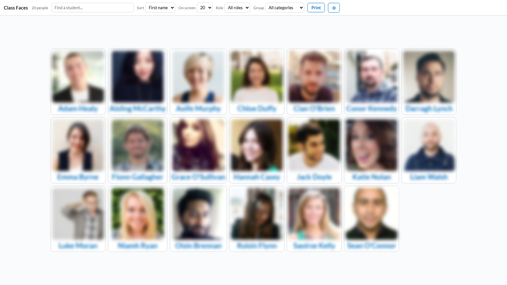

# Class Faces

A lightweight Brightspace (D2L) widget that shows your class as a grid of faces — profile photos, names, and optional emails — so you can learn who's who, take a quick visual roll call, or print a face sheet for the first week of term.

Works with any Brightspace instance. No server, no API keys — it runs on the page inside Brightspace and uses your own login session.

---

## Screenshot



*Demo data, blurred as you would for a real class: names are fictional and photos are placeholder portraits from randomuser.me.*

---

## What it does

- **Face grid** — every student in the classlist as a tile with their Brightspace profile photo (or a coloured-initials avatar when they have no photo). Tiles auto-size to fill the screen.
- **Search** — filter by name or email as you type.
- **Sort by first or last name** — tiles always display the sorted part of the name first, so the grid reads in the same order you're scanning it: sorting by first name shows `Aoife Murphy`, sorting by last name shows `Murphy, Aoife` — regardless of how your Brightspace formats display names.
- **Filter by group** — pick a **group category** (e.g. *Lab Groups*, *Tutorial Groups*), then a **group** within it, and the grid shows only that group's members. The control only appears when the course actually has group categories.
- **Filter by role** — a **Role** dropdown (e.g. show only *Learner*, hiding instructors and TAs). The control appears only when role information can be determined (see below).
- **Hover zoom + details card** — hover over any photo and it enlarges for a closer look, with a card underneath (matched to the photo's width) showing name, email, role, and pronouns (pronouns appear only when the person has set them and your Brightspace has pronouns enabled). The card is clickable: move the pointer down into it and click the name to open the student's Class Progress, or the email to start a message.
- **Names link to Class Progress** — click any student's name to open their Class Progress summary (`/d2l/le/classprogress/userprogress/{userId}/{orgUnitId}/Summary`) in a new tab.
- **Paging** — choose how many faces to show per screen (10–60 or All); flip pages with the on-screen buttons or the ← / → arrow keys.
- **Print a face sheet** — the Print button prints the *entire* filtered class (not just the current page) as a landscape face sheet with the course name and date.
- **Open in new tab** — when the widget is embedded in a homepage panel it shows an **Open in new tab ↗** button, because the full-page view is the best experience. The button carries the course ID with it, so the new tab loads the same course automatically.

---

## How it works

The page calls Brightspace's own REST APIs from the browser, using the session cookie of whoever is viewing it:

| Purpose | Endpoint |
|---|---|
| API version discovery | `GET /d2l/api/versions/` |
| Course name | `GET /d2l/api/lp/{ver}/courses/{orgUnitId}` |
| Classlist | `GET /d2l/api/le/{ver}/{orgUnitId}/classlist/` |
| Group categories | `GET /d2l/api/lp/{ver}/{orgUnitId}/groupcategories/` |
| Groups in a category | `GET /d2l/api/lp/{ver}/{orgUnitId}/groupcategories/{catId}/groups/` |
| Profile photos | `GET /d2l/api/lp/{ver}/profile/{profileId}/image` |

Everything shown on a tile and in the hover card — names, email, role, pronouns — comes from the single classlist call: it returns `FirstName`, `LastName`, `Email`, `ClasslistRoleDisplayName`, and `Pronouns` for every enrolled user.

---

## Roles — how the Role filter works

The Role dropdown lets you narrow the grid to one role — most usefully **Learner**, so instructors and TAs don't appear on the face sheet. Each person's role is also shown in the hover card when you hover over their photo.

Role names come from the `ClasslistRoleDisplayName` field of the classlist call — the same role label you see in the Role column of the Classlist page. The dropdown is populated with the distinct roles actually present in the course; if the field comes back empty for everyone (it requires the LE API version that introduced it), the dropdown simply doesn't appear and everything else works normally.

Because the requests ride on your login session, the page **must be served from your Brightspace site** (as a widget or a content page). Opening the HTML file locally will not work.

You only see what you're allowed to see: the widget works for anyone who already has permission to view the classlist in that course. If group information isn't visible to you, the group filter simply doesn't appear.

---

## Setup

### Option A — Homepage widget

1. Go to **Admin Tools → Widgets → New Widget**
2. Name it e.g. `Class Faces`
3. Under **Content**, open the HTML source editor and paste the entire contents of `class-faces.html`
4. Save, then add the widget to a course homepage panel

> The file contains the Brightspace replacement string `{OrgUnitId}` (in the `orgunitid` meta tag), which Brightspace substitutes with the current course's ID at render time. Don't replace it manually.

### Option B — Content page (no Widgets access needed)

1. In any course you control (your sandbox works fine), create a new **content page**
2. Paste the contents of `class-faces.html` into the page's HTML source editor
3. Hide the page from students if you don't want them to see it
4. Open the page whenever you want the face grid

On a content page the course is auto-detected from the page URL instead of the replacement string.

---

## Targeting another course (the OrgUnit ID setting)

Click the **⚙ gear** button to open the settings bar. It shows the auto-detected **OrgUnit ID** — the number Brightspace uses to identify the course (it's the number in the course homepage URL, e.g. `/d2l/home/24643` → `24643`).

Type a different OrgUnit ID and click **Reload**, and the widget loads *that* course's classlist instead. This means you can:

- **Run it from your sandbox** — paste the page into your sandbox course once, then point it at any module you teach by entering that module's OrgUnit ID. No need to install it in every course.
- Keep one copy and switch between your modules on the fly.

You still need classlist permission in the target course — the widget can't show you anything Brightspace itself wouldn't let you see.

---

## Configuration

Fallback API versions are set at the top of the script and are only used if version auto-detection fails:

```javascript
var FALLBACK_LP = '1.31';
var FALLBACK_LE = '1.53';
```

The Class Progress links, profile photos, and all data are fetched relative to the Brightspace site the page is served from, so nothing is hard-coded to a specific institution.

---

## Assets & dependencies

None. A single self-contained HTML file — no external scripts, stylesheets, or build step.
